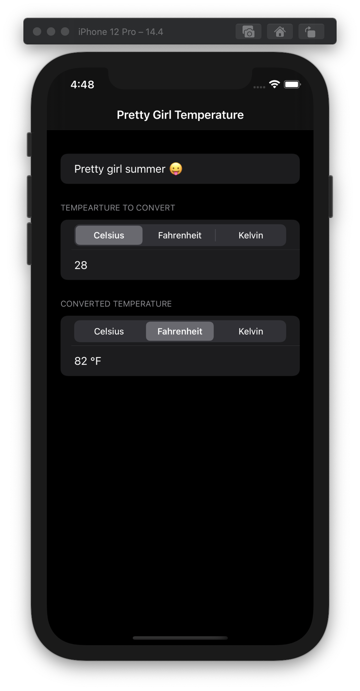

# Challenge Day #1 - Pretty Girl Temperature

https://www.hackingwithswift.com/100/swiftui/19

## Challenge
> "... build an app that handles unit conversions: users will select an input unit and an output unit, then enter a value, and see the output of the conversion."

## Topics

|Day 19 :white_check_mark: | Screenshot |
|:--|:--|:--|
| Created a temperature converter app from scratch (reviewing what I had previously worked on :grimacing: face)| |
