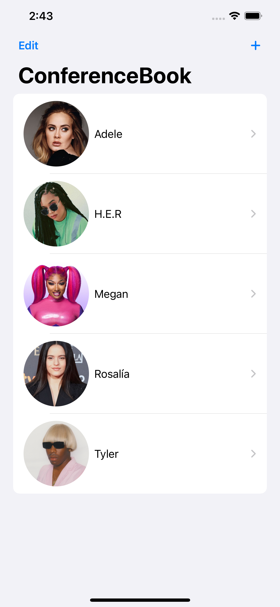
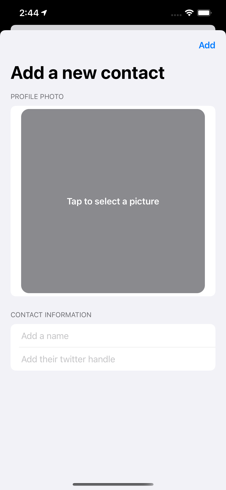
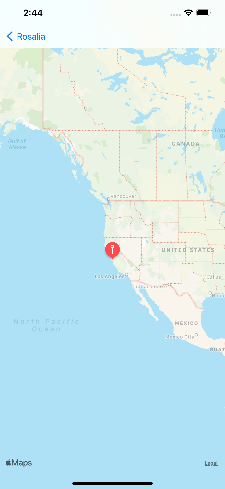

# Milestone Project #4 - FriendFace

https://www.hackingwithswift.com/100/swiftui/77
https://www.hackingwithswift.com/100/swiftui/78

## Challenge
> "... build an app that asks users to import a picture from their photo library, then attach a name to whatever they imported."

## Topics

|Day 77 :white_check_mark: | Day 77 :white_check_mark:  |
|:--|:--|
| Completed the core milestone project! | Added MapKit to the project | 
|  ||

## Final Project
| Main View | Adding an User | Detail View | Map View |
|:--|:--||:--|:--|
| | | | |
