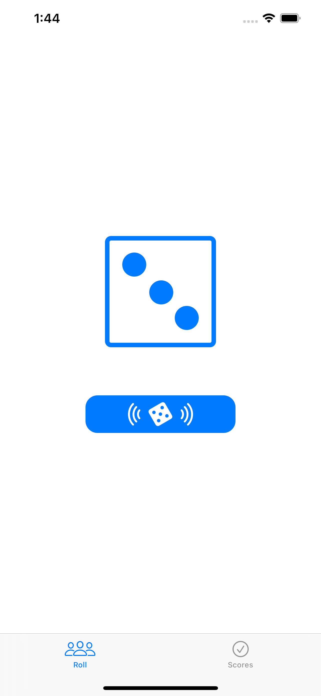
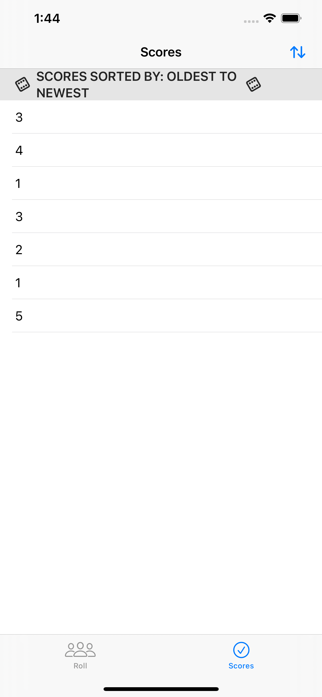

# Milestone Project #6 - DiceRoll

https://www.hackingwithswift.com/100/swiftui/95

## Challenge
> "...  an app that helps users roll dice then store the results they had."

## Topics

|Day 95 :white_check_mark: | Media |
|:--|:--|
| Completed the core milestone project! |  |  

## Final Project

| Main View  | Scoreboard  | 
|:--|:--|
|   |  | 
