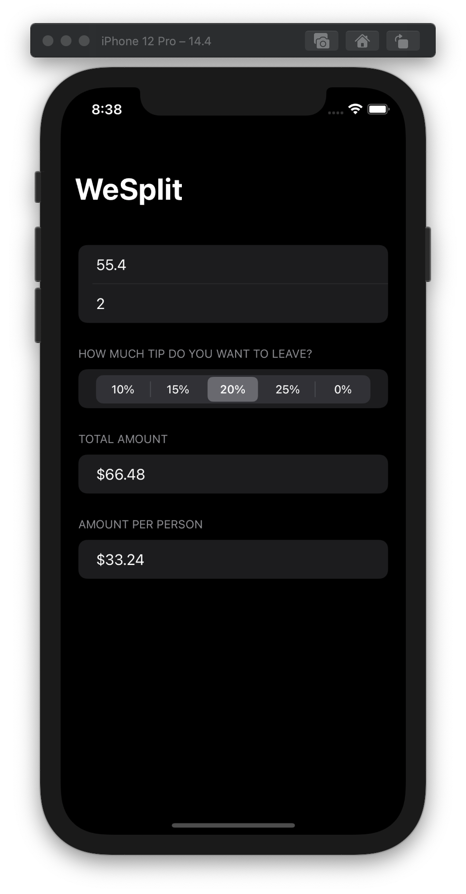

# Project #1 - WeSplit

https://www.hackingwithswift.com/100/swiftui/16

> "... a check-splitting app that you might use after eating at a restaurant – you enter the cost of your food, select how much of a tip you want to leave, and how many people you’re with, and it will tell you how much each person needs to pay."

## Topics
Form, Modifiers, Section, Group, NavigationView, @State, Text, Textfield, Picker, Segmented Control, ForEach

|Day 16 :white_check_mark: | Day 17 :white_check_mark: | Day 18 :white_check_mark: |
|:--|:--|:--|
|Worked with property wrappers (state), modifiers (very high-level), forms, and using loops to create views.| TWorked with different pickers (Segmented Controls) and reinforced property wrappers (State) | Topics review + challenges|

## Challenges

From [Hacking with Swift](https://www.hackingwithswift.com/books/ios-swiftui/wesplit-wrap-up):
>1. Add a header to the third section, saying “Amount per person”.
>2. Add another section showing the total amount for the check – i.e., the original amount plus tip value, without dividing by the number of people.
>3. Change the “Number of people” picker to be a text field, making sure to use the correct keyboard type.

|before challenges| after challenges|
|:--:|:--:|
|||
