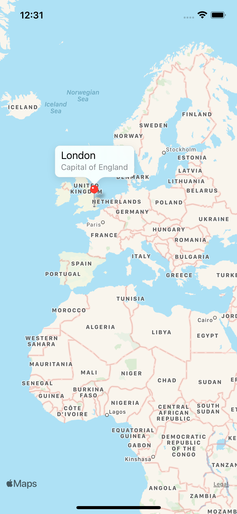

# Project #14 - BucketList

https://www.hackingwithswift.com/100/swiftui/68

> ...  an app that lets the user build a private list of places on the map that they intend to visit one day, add a description for that place, look up interesting places that are nearby, and save it all to the iOS storage for later.

## Topics
Comparable, operator overloading, FileManager, MVC, MapKit, LocalAuthentication, NSError, MKPointAnnotation, MKMapView

|Day 68 :white_check_mark: | Day 69 :white_check_mark: | Day 70 :white_check_mark: | Day 71 :white_check_mark: | Day 72 :white_check_mark: | Day 73 :white_check_mark: |
|:--|:--|:--|:--|:--|:--|
| learned about Comparable, operator overloading, FileManager, writing data to the documents directory, and handling a View's state using Enums.  | worked with MapKit, UIViewRepresentable, and LocalAuthentication (used it to work with Touch ID and Face ID).  | worked more with MKMapView, MKPointAnnotation, got more comfortable with coordinators, and many MapKit delegate methods 😭. | continued with the project, we can now edit a location, and we added a section that displays nearby places to visit. This was used using URLSession to get data from Wikipedia. |  |  |
|  🗺  | |   | |  |  |  |

## Challenges

From [Hacking with Swift]():
>1. 
>2. 
>3. 
