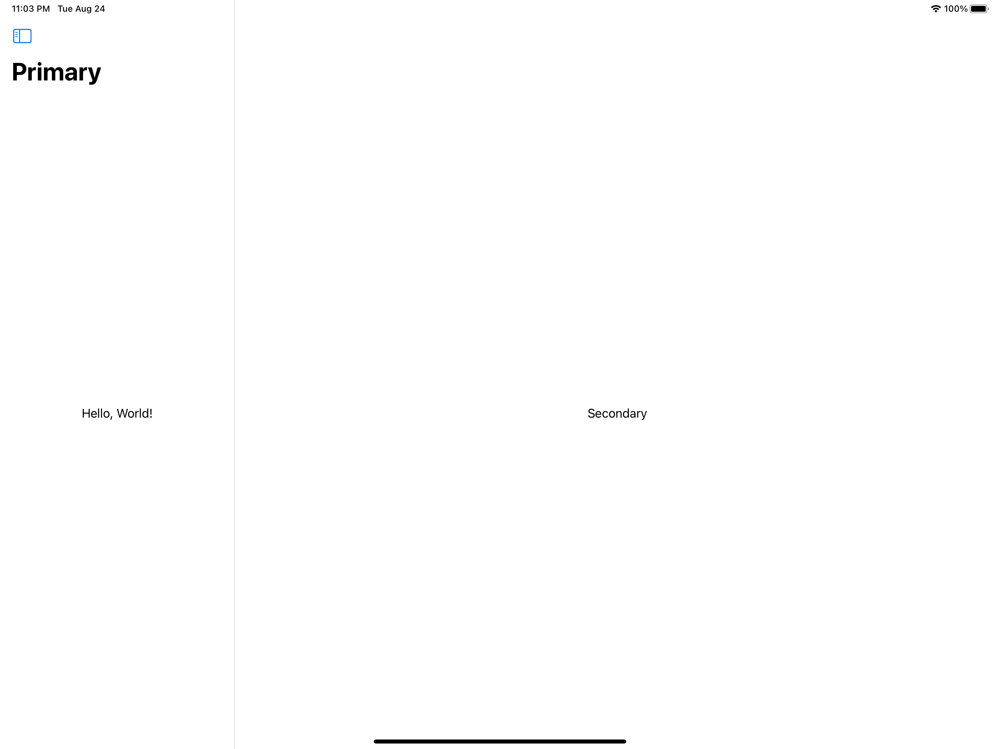

# Project #19 - SnowSeeker

https://www.hackingwithswift.com/100/swiftui/96

> ...  an app to let users browse ski resorts around the world, to help them find one suitable for their next holiday.

## Topics
StackNavigationViewStyle, UIDevice, .phoneOnlyStackNavigationView()

| Day 96 :white_check_mark: | Day 97 :white_check_mark: | Day 98 :white_check_mark: | Day 99 :white_check_mark: | 
|:--|:--|:--|:--|
| learned about UISplitViewController and how to recreate it in SwiftUI using NavigationView, how to display a sheet && alert using an optional Identifiable object, and also learned more about Group's behavior. | started the final project! Today's focus was to build the initial view structure. | 98 | 99 |
|  |  |  |  | 

## Challenges

From [Hacking with Swift]():
>1. 
>2. 
>3. 
