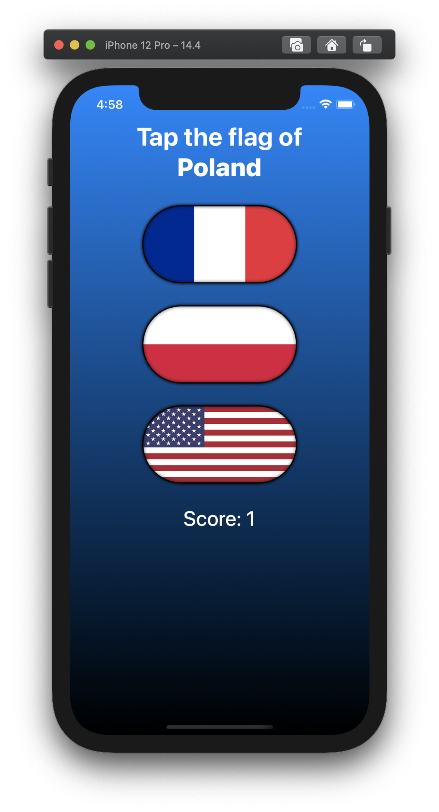
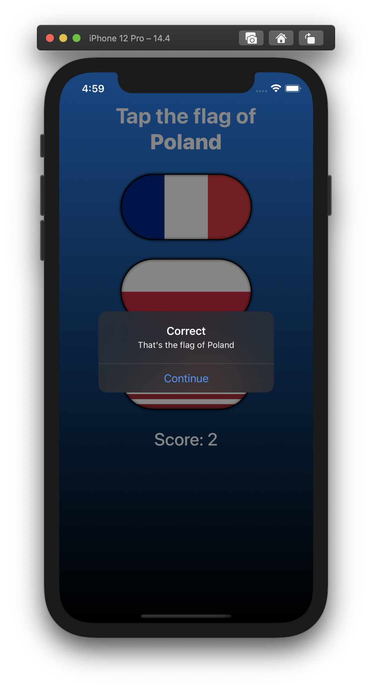

# Project #2 - GuessTheFlag

https://www.hackingwithswift.com/100/swiftui/20

> "... a guessing game that helps users learn some of the many flags of the world."

## Topics
HStack, VStack, ZStack, Alert, Image, Button, Colors and, Gradients.

|Day 20 :white_check_mark: | Day 21 :white_check_mark: | Day 22 :white_check_mark: |
|:--|:--|:--|
|(Z,H,V)Stacks, Buttons, Alerts, Color and Gradient views| Alerts, buttons, actions and more gradients |  Topics review + challenges|
||| |

## Challenges

From [Hacking with Swift](https://www.hackingwithswift.com/books/ios-swiftui/guess-the-flag-wrap-up):
>1. Add an @State property to store the user’s score, modify it when they get an answer right or wrong, then display it in the alert.
>2. Show the player’s current score in a label directly below the flags
>3. When someone chooses the wrong flag, tell them their mistake in your alert message – something like “Wrong! That’s the flag of France,” for example.

|before challenges| after challenges|
|:--:|:--:|
|||
