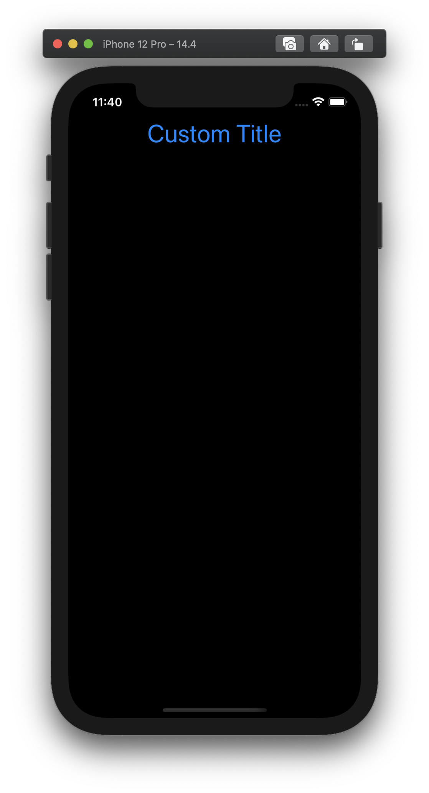
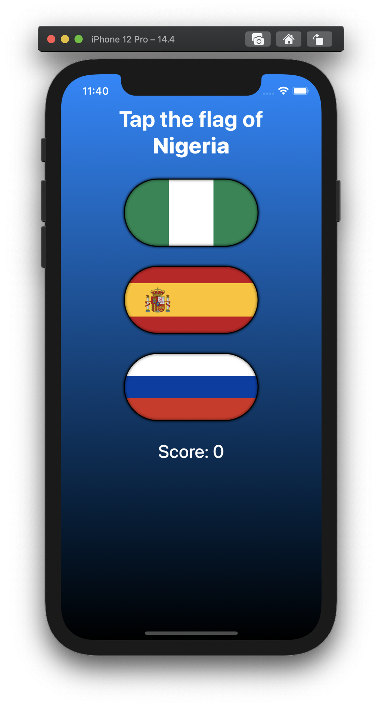

# Project #3 - ViewsAndModifiers

https://www.hackingwithswift.com/100/swiftui/24

## Topics
View, ViewModifier, Modifiers, and `some` operator

|Day 23 :white_check_mark: | Day 24 :white_check_mark: | 
|:--|:--|
|Learned more about modifiers, containers, and SwiftUI’s performance.| Completed the challenges for the day (created custom views and modifiers!) |

### [Notes](https://github.com/lareenmelo/100-days-of-swiftui/blob/main/PROJECT3/D23.md)

## Challenges

From [Hacking with Swift](https://www.hackingwithswift.com/books/ios-swiftui/views-and-modifiers-wrap-up):
>1. Create a custom `ViewModifier` (and accompanying `View` extension) that makes a view have a large, blue font suitable for prominent titles in a view.
>2. Go back to project 1 and use a conditional modifier to change the total amount text view to red if the user selects a 0% tip.
>3. Go back to project 2 and create a `FlagImage()` view that renders one flag image using the specific set of modifiers we had.

|challenge #1| challenge #2|challenge #3|
|:--:|:--:|:--:|
||||
