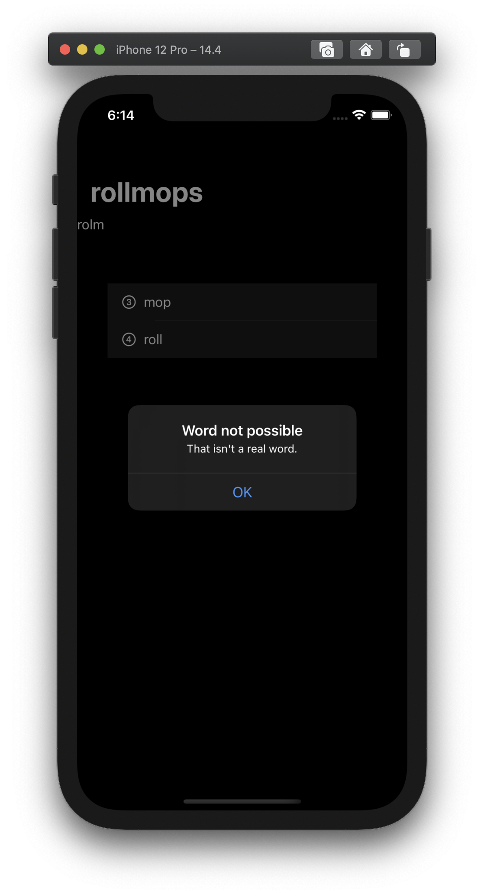
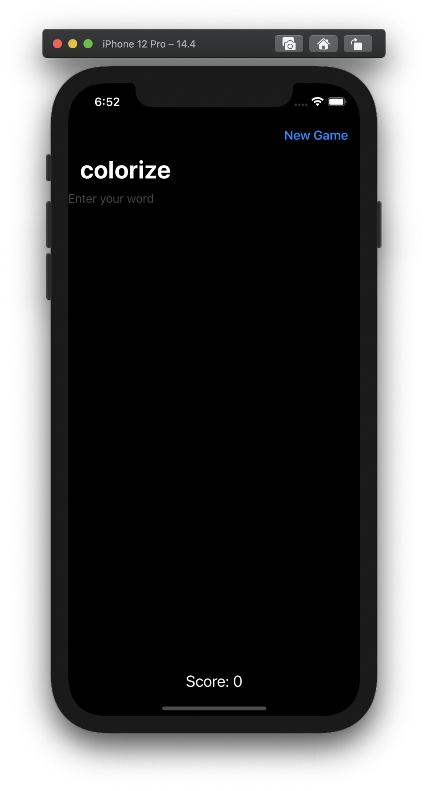

# Project #4 - WordScramble

https://www.hackingwithswift.com/100/swiftui/29

> ... the game will show players a random eight-letter word, and ask them to make words out of it. For example, if the starter word is “alarming” they might spell “alarm”, “ring”, “main”, and so on.

|||
|:--:|:--:|

## Topics
List, Bundle, UITextChecker, onAppear, onCommit
|Day 29 :white_check_mark: | Day 30 :white_check_mark: | Day 31 :white_check_mark: |
|:--|:--|:--|
|Learned about List, Bundle, and UITextChecker | Worked with Bundle, onAppear, used TextField's onCommit action, used UITextChecker for validations, and completed the project | Completed the challenges for the project|

## Challenges

From [Hacking with Swift](https://www.hackingwithswift.com/books/ios-swiftui/word-scramble-wrap-up):
>1. Disallow answers that are shorter than three letters or are just our start word. For the three-letter check, the easiest thing to do is put a check into `isReal()` that returns false if the word length is under three letters. For the second part, just compare the start word against their input word and return false if they are the same.
>2. Add a left bar button item that calls `startGame()`, so users can restart with a new word whenever they want to.
>3. Put a text view below the `List` so you can track and show the player’s score for a given root word. How you calculate score is down to you, but something involving number of words and their letter count would be reasonable.

|before challenges| after challenges|
|:--:|:--:|
|||
