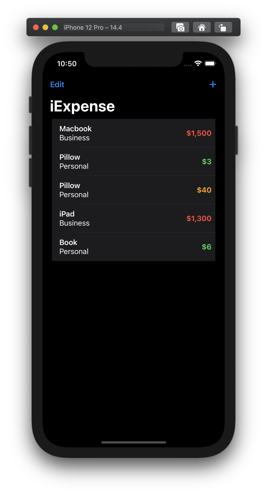
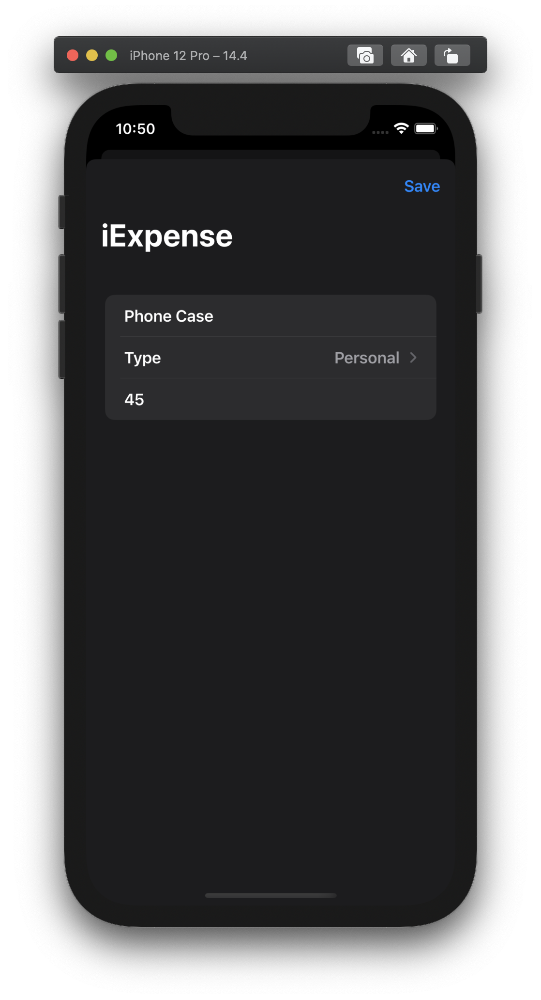
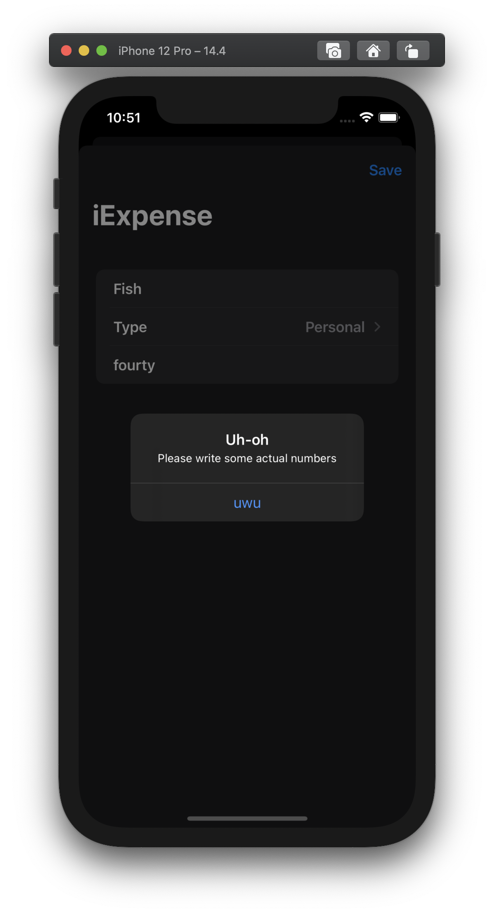

# Project #7 - iExpense

https://www.hackingwithswift.com/100/swiftui/36

> ... expense tracker that separates personal costs from business costs

## Topics
ObservedObject, EnvironmentObject, sheets, Codable, UserDefaults, .onDelete() modifier 

|Day 36 :white_check_mark: | Day 37 :white_check_mark: | Day 38 :white_check_mark: |
|:--|:--|:--|
| learned about the ObservedObject and EnvironmentObject property wrappers, presenting and dismissing sheets, onDelete() modifier, UserDefaults and Codable | created project 7 used Published, ObservedObject, List, UserDefaults and, Codable | completed the challenges for the project |
||||

## Challenges

From [Hacking with Swift](https://www.hackingwithswift.com/books/ios-swiftui/iexpense-wrap-up):
>1. Add an Edit/Done button to `ContentView` so users can delete rows more easily.
>2. Modify the expense amounts in `ContentView` to contain some styling depending on their value – expenses under $10 should have one style, expenses under $100 another, and expenses over $100 a third style. What those styles are depend on you.
>3. Add some validation to the Save button in `AddView`. If you enter *“fish”* or another thing that can’t be converted to an integer, show an alert telling users what the problem is.

| Main View | Add new expense | Wrong input alert |
|:--|:--|:--|
||||
