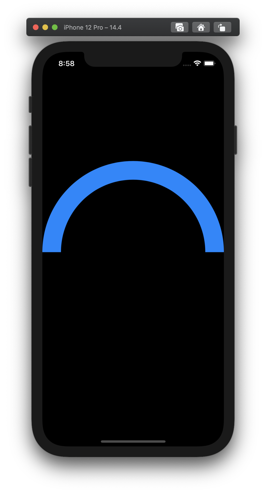

# Project #9 - Drawing

https://www.hackingwithswift.com/100/swiftui/43

## Topics
Shape(), InsettableShape, Path, strokeBorder(), ImagePaint, drawingGroup(), CGAffineTransform

|Day 43 :white_check_mark: | Day 44 :white_check_mark: | Day 45 :white_check_mark: | Day 46 :white_check_mark: |
|:--|:--|:--|:--|
| learned how to draw shapes using Path, worked with StrokeStyle(), and InsettableShape()  | worked with CGAffineTransofrm, ImagePaint, and drawingGroup() |  |
||||

## Challenges

From [Hacking with Swift]():
>1. 
>2.
>3. 
